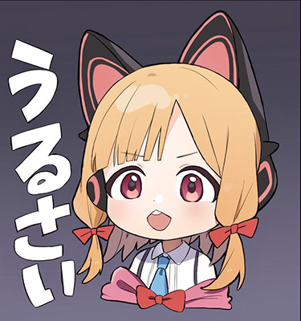
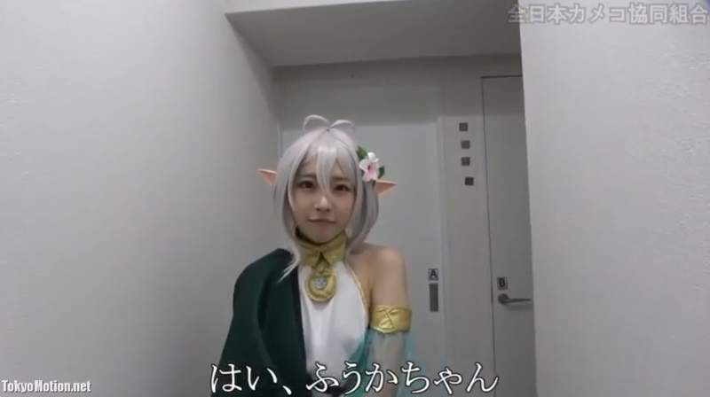
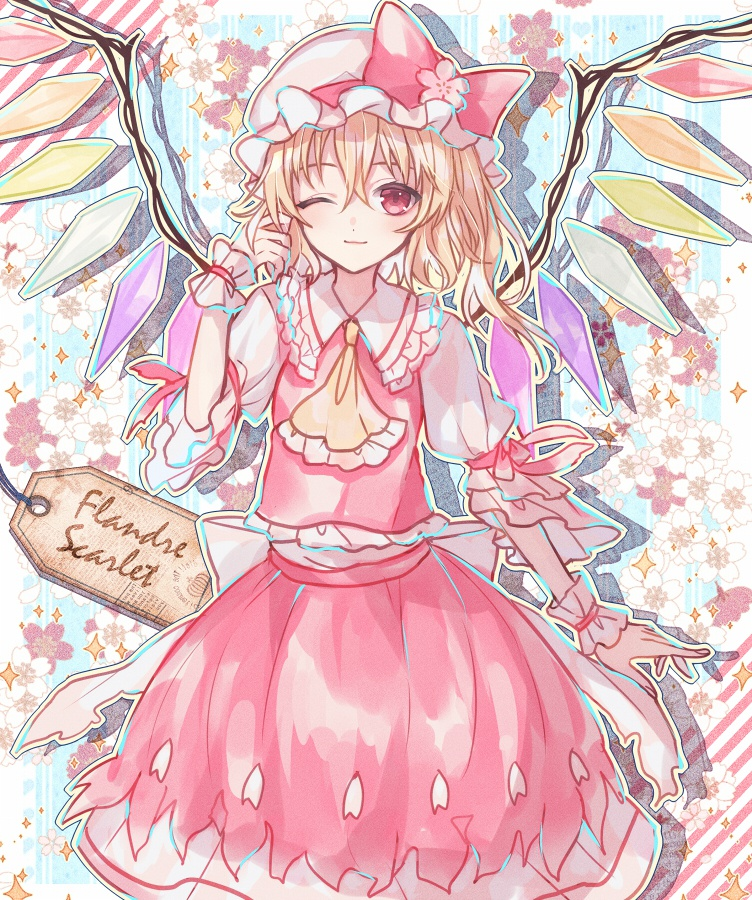

# 【老婆探测器】1个可解释的动漫角色分类模型

事情是这样的，大家有用过网上别人训练好的动漫角色分类模型吗？

这些模型往往都有1个问题，那就是它们不认得新角色，所以还得隔1段时间训练1次，然后把这段时间内的角色标签重打1遍。

于是我就想，要不就不分类了，用embedding召回的方法来做，这样1来，出了新角色以后，只需要把这个角色的embedding入库，不就可以识别出这个角色的其他图了嘛！

不过我连embedding模型也没有，所以这次直接用[ML-Danbooru](https://github.com/7eu7d7/ML-Danbooru)凑合1下<sub>(这是1个标签模型)</sub>。把标签用手凑1凑，拼成1个embedding吧！


## 使用方法

这个仓库可以使用pip安装，只要`pip install git+https://github.com/RimoChan/waifu-sensor.git`就可以了。

然后你就可以把1张图片输入`predict`里:

```python
from PIL import Image
from waifu_sensor.v2 import predict

result = predict(Image.open('urusai.jpg'))
print(result)   # [('momoi (blue archive)', 1.8325137893845367), ('iijima yun', 2.4338155048445755), ('midori (blue archive)', 2.5287921933510806)]
```

下面是1些预测的样例:

|  图片  | 预测结果 1  | 预测结果 2  | 预测结果 3  |
|  ----  | ----  | ----  | ----  |
|  | 才羽桃井 <br/> 距离=1.83 | 饭岛结音 <br/> 距离=2.43 | 才羽绿 <br/> 距离=2.53 |
|  | 可可萝 <br/> 距离=2.01 | さびつき <br/> 距离=2.15 | 本间芽衣子 <br/> 距离=2.35 |
|  | 芙兰朵露·斯卡蕾特 <br/> 距离=1.73 | 露娜·切露德 <br/> 距离=2.57 | 玛艾露贝莉·赫恩 <br/> 距离=2.60 |

我也没想到它居然还能识别cosplay，以后带着这个去漫展就不会有不认识的角色了！


还有1个接口，叫做「为什么不是」。

比如说，你的不玩东方的朋友在上网的时候看到了1张芙兰朵露的图片，但是她认成了蕾米莉亚，你就可以给她解释，为什么这张是芙兰朵露，像是这样——

```python
from PIL import Image
from waifu_sensor.v2 import why_not

result = why_not(Image.open(r'flandre.jpg'), 'remilia scarlet')
print(result)     # [('blonde_hair', 0.9877064707905355), ('blue_hair', -0.8072149222547358), ('side_ponytail', 0.7606641085460932)]
```

模型说，这张图里的人是金发(blonde_hair)，而蕾米莉亚是蓝发(blue_hair)，而且蕾米莉亚没有侧马尾(side_ponytail)。


## 关于训练

这次用的数据集是[danbooru2022](https://huggingface.co/datasets/animelover/danbooru2022)。

下了6%的数据出来训练，因为数据太多了，下不动啦。然后过滤出只包含1个女性角色的图片，总的训练样本数大概是90000。

- 训练集下了36个包，是 `data-0\d[023457]1.zip`。 
- 测试集是 `data-0010.zip` 和 `data-0030.zip`。

测完发现这个瞎搞的准确率其实没有很高，top1命中79%，top3命中85%。

嘛，毕竟有5684个分类，长尾的分类太多了。我自己都认不出79%的图，那它已经比我认得多啦！

不过因为只给所有的图打1次标签，相当于只需要炼1个epoch，训练很快。

## 标签是怎么做成embedding的

其实是这样的，因为我们有1个先验知识，就是1般来说，不同图中的1个角色，表情会变，衣服小概率会变，而发型、发色、瞳色之类的1般不会变。

所以我把和人物相关的标签用手1个1个拿出来，按相同顺序拼成1个embedding，没有就补0。

举个例子，假如我们有4个标签，分别是`黄色头发`、`粉色头发`、`黄色眼睛`、`粉色眼睛`，然后我们输入1张[小桃的图片](urusai.jpg)，就应该得到embedding = `[1, 0, 1, 0]` <sub>(实际上由于标签模型拿不到1，有可能是`[0.9, 0, 0.9, 0]`)</sub>。

但是这样有1个问题，我怎么知道动漫人物的哪些标签是会变的？换句话说，究竟该挑选哪几个标签来组成这个embedding？

实际上我也不知道怎么选，这些标签是暴力搜索出来的。

我准备了1个验证集，在训练完上面的embedding之后，我把几百个标签都丢进贝叶斯里，搜索哪些标签是要的，哪些标签是不要的，直到在验证集上达到最佳准确度为止。最后就直接把搜索得到的标签硬编码到代码里了。


## 结束

就这样，我要去和电脑里的waifu亲热了，大家88！
